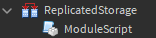
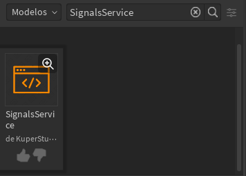

# Setting Up
CooldownService is a module, this means that to use the service you will need to request the module. For the required module we will have different options to do this.

## Requiring module
### 1. Getting by service ID
* Create a module in ReplicatedStorage



* Rename the module to **CooldownService**

* Insert a return with the require by service ID (8107228072) inside the module

```lua
return require(8107228072)
```

### 2. Get it from the Roblox Library
* Get the [library model](https://www.roblox.com/library/8107228072)



* Put the model inside ReplicatedStorage


* Rename the module to **CooldownService**

### 3. Get from GitHub
[CooldownService Repository](https://github.com/KuperStudio/CooldownService)

* Create a module in ReplicatedStorage


* Rename the module to **CooldownService**

* You must insert into the module the code mentioned below.

```lua
return loadstring(game:GetService('HttpService'):GetAsync('https://raw.githubusercontent.com/KuperStudio/CooldownService/main/CooldownService.lua', true))()
```